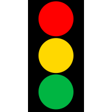

# Traffic Light Dashboard
  
This is a simple React JS single page application (SPA) for controlling virtual Traffic Intersections.  
The backend is powered by AWS AppSync and DynamoDB.  

This frontend app was originally built for a [previous IoT project of mine](https://github.com/tsengia/iot-thingy91-traffic-lights) and has now been refactored to use AWS AppSync instead of oneM2M.

__[Try it out here!](https://main.d357xgwrfyl7b5.amplifyapp.com/)__

---

## Development
Before developing, you will need to install the required node modules, run the following command to install them:
```bash
npm ci
```

To launch the development server, run the following command from this directory: 
```
npm start
```

## Deployment
To build a deployment version of this app, run this command: `npm run build`.

This will create a set of static files in the `build` directory.  
You can copy/move these files into your `/var/www/html` directory to serve them to your users.
